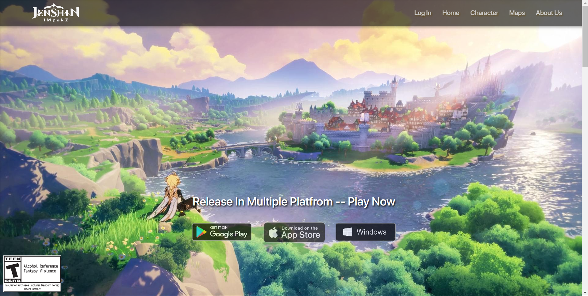
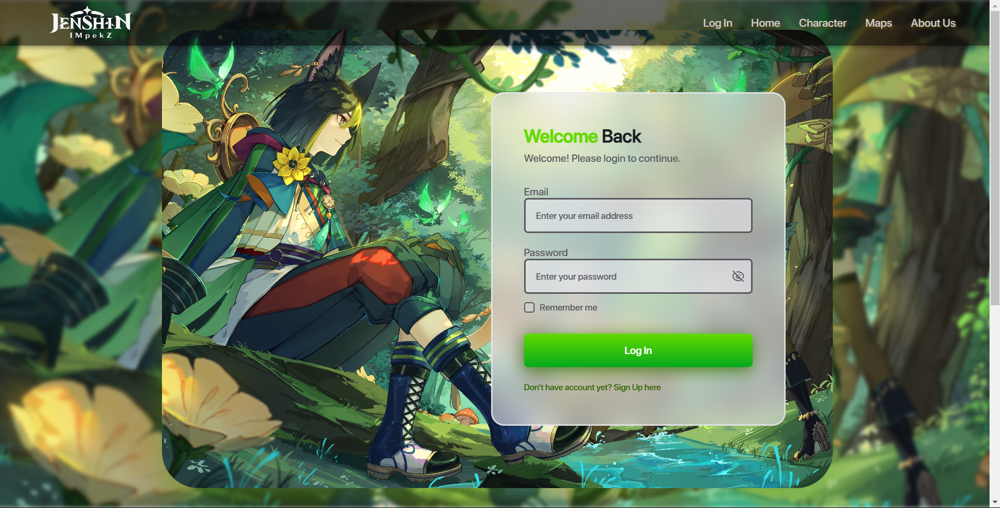
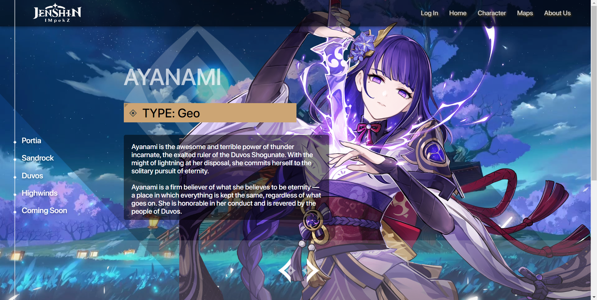
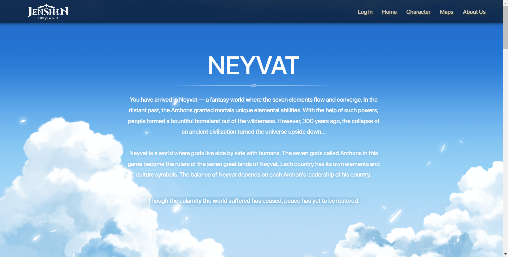
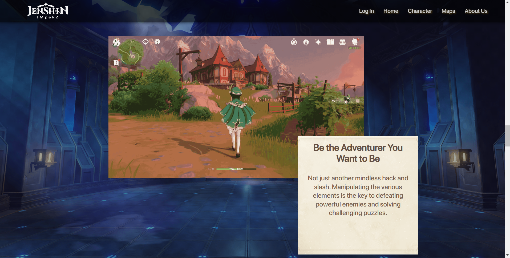

# Jenshin Impekz
<table>
<tr>
<td>
  This is an Lab Human Computer Interaction courses project named Jenshin Impekz that making an web application of parody game from popular game named Genshin Impact. Jenshin Impekz is an action role-playing game developed and published by miHoYo. Jenshin Impekz is an open-world action role-playing game that allows the player to control one of four interchangeable characters in a party.
</td>
</tr>
</table>

## Homepage

## Login Page

## Character Page

## Map Page

## About Us Page

## Team
- Dustin Bijou Arasy
- I Made Ananta Yogananda

## License
Copyright © [Dustin Arasy ](https://github.com/dustin-arasy) & [Ananta Yogananda ](https://github.com/yogananda26)

